# Página Web con GitHub

## <mark style="color:purple;">¿Cómo diseñar una página web gratuita con GitHub?</mark>

GitHub es una herramienta altamente recomendada para la creación de nuestro portafolio o página web de forma gratuita. A continuación, te invito a seguir los siguientes pasos para comenzar este proceso:

### <mark style="color:purple;">Creación de la cuenta de usuario.</mark>

* Abre tu navegador web y ve a la página principal de GitHub en el siguiente link.


liko para GitHub.


* Localizamos ¨Sign up¨ para registrarnos a la plataforma.

<figure><figcaption>
En el margen superior derecho encontramos Sign Up, hacemos click para registrarnos en la plataforma.
</figcaption></figure>

* Ahora debemos ingresar nuestros datos personales.

<figure>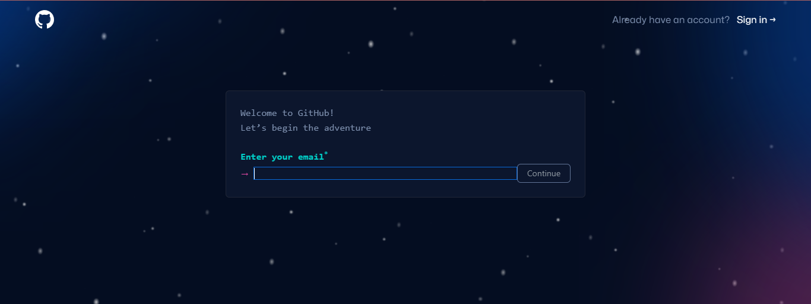<figcaption>
Ingresar email, por ejemplo tu cuenta de Gmail.
</figcaption></figure>

<figure>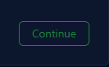<figcaption>
Después de completar tu cuenta de email, hacer click en esta casilla para continuar.
</figcaption></figure>

<figure>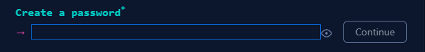<figcaption>
Lo siguiente es crear una contraseña, una vez escrito volver a hacer click en continuar.
</figcaption></figure>


Seleccionar una contraseña óptima, es decir segura, para ello se recomienda una contraseña con 15 caracteres, o de 8 caracteres combinando letras mayúsculas y minúsculas, y también números.


<figure><figcaption>
La contraseña no debe ser muy corta, se sugiere que contenga 15 caracteres, o 8 caracteres con letras mayúsculas y minúsculas, e incluir números.
</figcaption></figure>

<figure><figcaption>
En este caso la contraseña es medianamente segura, la plataforma hace hincapié en la sugerencia de la cantidad de caracteres.
</figcaption></figure>

<figure><figcaption>
Una vez ingresado una contraseña óptima, la casilla se verá verde, ahora podemos continuar.
</figcaption></figure>

<figure><figcaption>
Por último escribimos nuestro nombre de usuario que utilizaremos en la plataforma.
</figcaption></figure>


Si nuestro nombre de usuario no se encuentra disponible para el registro, la plataforma no nos permitirá continuar.


<figure><figcaption>
El nombre de usuario que ingresemos debe estar disponible para poder continuar.
</figcaption></figure>


El nombre de usuario solo puede contener caracteres alfanuméricos o un solo guion, y no puede empezar ni terminar con un guion.


<figure><figcaption>
El nombre de usuario solo puede contener caracteres alfanuméricos o un solo guion, y no puede empezar ni terminar con un guion. La traducción de hyphen es guion.
</figcaption></figure>

<figure><figcaption>
Se admite el uso de guion en el intermedio del nombre de usuario. 
</figcaption></figure>


Se puede utilizar números en el nombre de usuario.


<figure><figcaption>
La plataforma admite caracteres alfanuméricos para el nombre de usuario.
</figcaption></figure>


También se admite el uso de mayúsculas en el nombre de usuario.


<figure><figcaption>
El uso de letras mayúsculas el inicio como al final del nombre de usuario está permitido.
</figcaption></figure>

<figure><figcaption>
Ahora que contamos con un nombre de usuario que cumpla todos los requisitos podemos continuar.
</figcaption></figure>

Recibir notificaciones en el email.

<figure><figcaption>
Si quieres recibir notificaciones de actualizaciones y anuncios en tu email, deber escribir  ¨y¨ para sí, y ¨n¨ para no.
</figcaption></figure>

Verificar si no eres un Bot.

<figure><figcaption>
Medida de seguridad diseñada para evitar que programas automatizados (bots) creen cuentas de usuario en un sitio web o aplicación. La verificación de bots ayuda a mantener la integridad de una plataforma en línea al prevenir registros automatizados masivos y actividades maliciosas. Al requerir la participación humana en el proceso de registro, se reduce significativamente la posibilidad de cuentas falsas o actividades fraudulentas
</figcaption></figure>


En este punto la verificación puede no estar interrumpirse por diversos motivos, debemos desactivar el VPN, AdBlock o semejante para poder realizar el rompecabezas de verificación.


<figure><figcaption>
El rompecabezas se ha interrumpido.
</figcaption></figure>

 

<figure><figcaption>
La causa en este caso el AdBlock, debemos desactivarlo para continuar.
</figcaption></figure>

<figure>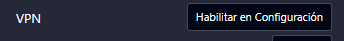<figcaption>
También se interrumpe con una red privada virtual o VPN (Virtual Private Network).
</figcaption></figure>

<figure><figcaption>
El rompecabezas de verificación consiste en girar la imagen isométrica de un animal para que coincida con la dirección que señala la mano en la imagen de la izquierda.
</figcaption></figure>

 

<figure><figcaption>
Una vez completado podemos enviar la respuesta.
</figcaption></figure>

Una vez que ingresamos todos nuestros datos solicitados y verificamos que no somos bots procedemos al último paso.

<figure>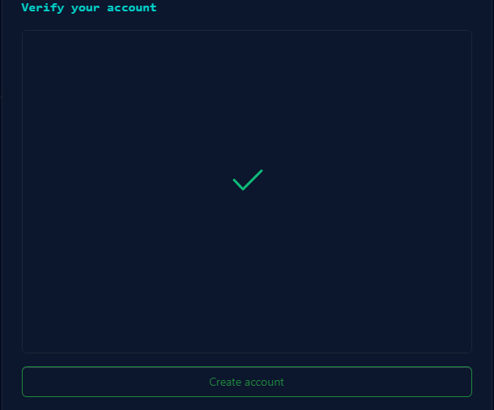<figcaption>
Hacemos click en Create Account ahora que fuimos descartados como bots.
</figcaption></figure>

Por último debemos ingresar un código numérico el cual es enviado a la cuenta de email ingresada para registrar.

<figure><figcaption>
Casillas para ingresar el código en GitHub.
</figcaption></figure>

 

<figure><figcaption>
El código es enviado e la cuenta de email en un correo.
</figcaption></figure>

Fin del proceso, la cuenta ha sido creada.

<figure><figcaption>
Finalmente logramos crear nuestra cuenta de GitHub, ¡Enhorabuena!
</figcaption></figure>

### <mark style="color:purple;">Crear un repositorio en GitHub</mark>

Para crear el repositorio utilizaremos GitHub Desktop.

<figure><figcaption>
Seleccionar en el inicio Create Repository, se encuentra hacia el margen izquierdo de nuestra página principal en la web.
</figcaption></figure>

<figure><figcaption>
Crearemos un repositorio en la web para luego clonarlo en GitHub Desktop.
</figcaption></figure>

<figure><figcaption>
El nombre del repositorio será el nombre de usuario.githib.io
</figcaption></figure>

<figure><figcaption>
No es necesario añadir nada más, creamos nuestro repositorio en público y seleccionamos ¨Create repository¨.
</figcaption></figure>

<figure><figcaption>
Nuestro repositorio ha sido creado.
</figcaption></figure>

### <mark style="color:purple;">Descargar GitHub Desktop</mark>

Antes de poder utilizar GitHub Desktop, primero debemos descargarlo.

<figure>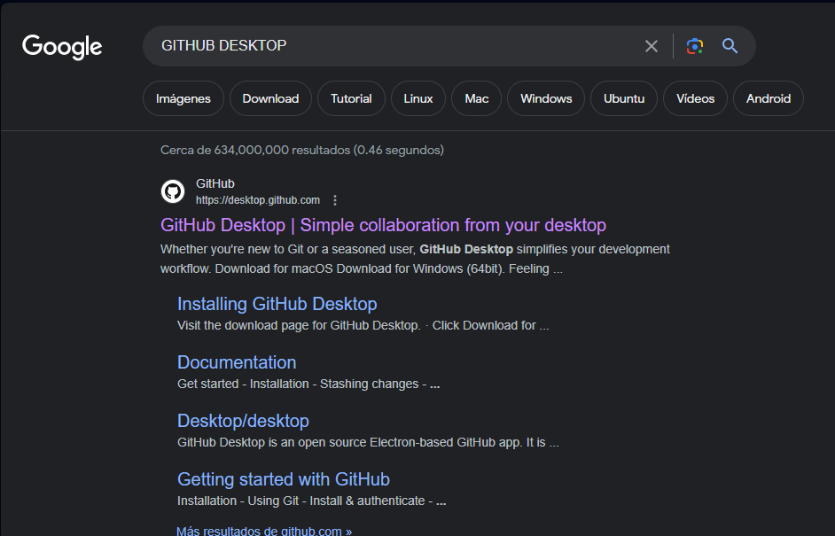<figcaption>
Buscar en ¨GitHub Desktop¨ para descargarlo.
</figcaption></figure>

<figure><figcaption>
Descargar la aplicación de acuerdo al Sistema Operativo que utilices.
</figcaption></figure>

<figure><figcaption>
Proceder a iniciar la descarga y esperar que finalice.
</figcaption></figure>

<figure><figcaption>
Una vez finalizada la descarga podemos abrir la aplicación en carpeta e instalarla.
</figcaption></figure>

<figure>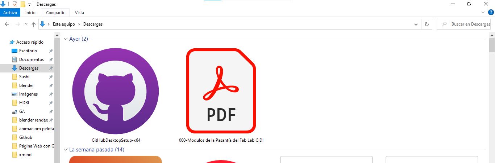<figcaption>
Aplicación visto desde la carpeta del equipo.
</figcaption></figure>

<figure><figcaption>
La aplicación iniciará la instalación.
</figcaption></figure>

<figure><figcaption>
Se abre la aplicación.
</figcaption></figure>

Para abrir la cuenta de GitHub en GitHub Desktop podemos acceder desde _File_, luego seleccionar _Options._

<figure>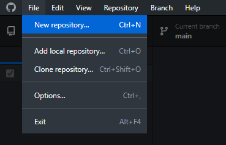<figcaption>
<em>File</em> se encuentra en el menú a la esquina superior izquierda.
</figcaption></figure>

<figure><figcaption>
seleccionar <em>Options.</em>
</figcaption></figure>

<figure><figcaption>
En <em>Options</em> debemos seleccionar <em>Account</em>s y luego <em>Sign In</em>.
</figcaption></figure>

 

<figure><figcaption>
Podemos ingresar desde la cuenta que tenemos abierta en el navegador.
</figcaption></figure>

<figure><figcaption>
Ahora debemos escribir el nombre de nuestro repositorio creado en la web. Debemos seleccionar <em>Clone repository from the internet.</em>
</figcaption></figure>

<figure>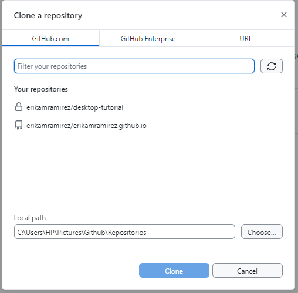<figcaption>
Pestaña de <em>Clone repository from internet.</em>
</figcaption></figure>

<figure><figcaption>
En este caso cloné el repositorio creado en la web, añadiendo la URL.
</figcaption></figure>

<figure><figcaption>
Carpeta creada en el equipo.
</figcaption></figure>

 

<figure><figcaption>
Para el <em>Local Path</em>, debemos crear una carpeta en nuestro escritorio para guardar nuestros repositorios en nuestro equipo.
</figcaption></figure>

<figure><figcaption>
Una vez que contamos con la URL del repositorio en la web y la carpeta de destino en nuestro equipo procedemos a <em>Clone.</em>
</figcaption></figure>

<figure><figcaption>
Volvemos automáticamente al inicio de GitHub Desktop, si nos fijamos en el margen superior izquierdo podemos comprobar que nuestro repositorio ha sido abierto.
</figcaption></figure>

 

<figure><figcaption>
En <em>Current repository</em> comprobamos que el repositorio se ha clonado con éxito.
</figcaption></figure>

<figure><figcaption>
Para ver nuestro repositorio en la Web hacer click en <em>View on GitHub.</em>
</figcaption></figure>

<figure>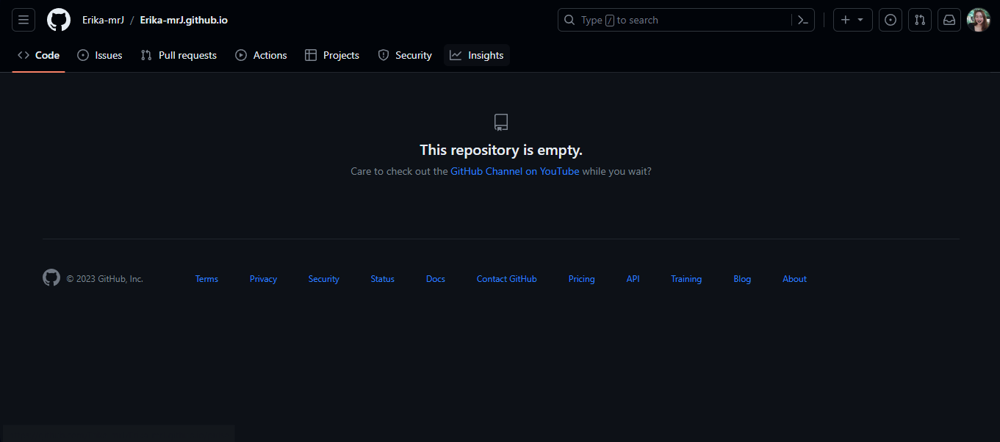<figcaption>
Al redirigirnos a la web nos encontramos que nuestro repositorio se encuentra vacío, lo que nos lleva al siguiente capítulo de nuestro tutorial en donde rellenamos nuestro repositorio creado.
</figcaption></figure>

### <mark style="color:purple;">GitBook</mark>


Ingresamos a la página de Gitbook el cual encuentra en el link.


<figure><figcaption>
Página de inicio de GitBook.
</figcaption></figure>

<figure>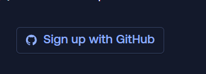<figcaption>
Seleccionamos <em>Sign up with GitHub.</em>
</figcaption></figure>

<figure><figcaption>
Información de permisos a aceptar para utilizar GitBook.
</figcaption></figure>

<figure>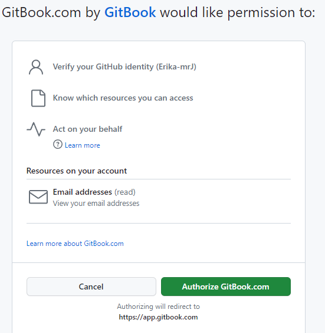<figcaption>
Hacemos click en <em>Authorize GitBook.com</em>
</figcaption></figure>

<figure>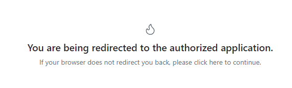<figcaption>
Esperar el redireccionamiento.
</figcaption></figure>

<figure><figcaption>
Nos pide registrarnos como organización, completamos los datos y seguimos.
</figcaption></figure>

<figure>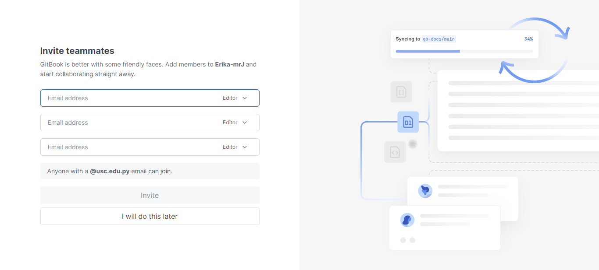<figcaption>
Ya que debemos registrarnos como organización por default, ahora podemos agregar a los miembros de la organización, en el caso seleccionaremos <em>I will do this later.</em>
</figcaption></figure>

<figure>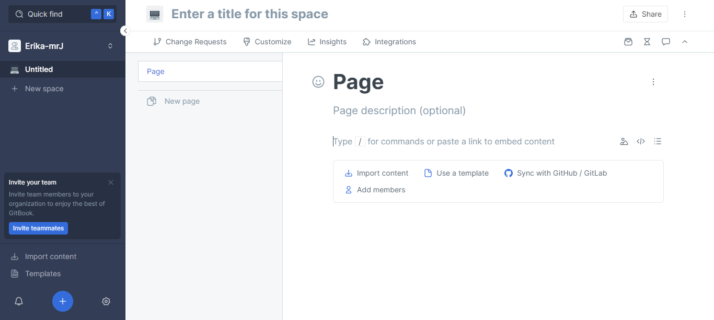<figcaption>
Finalmente hemos terminado esta sección del tutorial, ya contamos con una cuenta de GitBook vinculada a la cuenta de GitHub que creamos en un principio, ahora podemos agregar información a nuestro repositorio.
</figcaption></figure>

### <mark style="color:purple;">Crear pages</mark>

Una vez abierto la cuenta en GitBook podemos proceder a crear nuestra primera page, ya sea para registrar, crear un portafolio, etc.

<figure><figcaption>
Page en blanco.
</figcaption></figure>

#### Cambiar título del documento.

<figure><figcaption>
ubicar el mouse en <em>Enter a title for this space.</em>
</figcaption></figure>

 

<figure><figcaption>
Añadimos un nuevo título.
</figcaption></figure>

#### Agregar una imagen de portada antes del título.

<figure><figcaption>
Arriba de page podemos observar la opción para añadir <em>page cover</em>, es decir una imagen de portada.
</figcaption></figure>

<figure>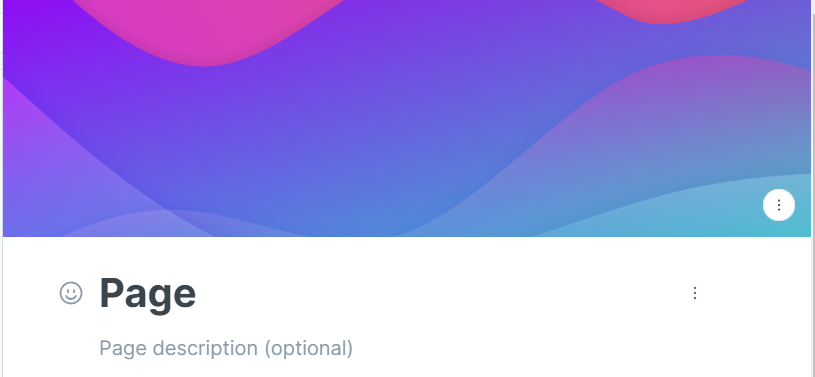<figcaption>
Una vez seleccionado aparece esta imagen default.
</figcaption></figure>

<figure><figcaption>
Para configurarla debemos encontrar este menú desplegable en el margen inferior derecho.
</figcaption></figure>

 

<figure>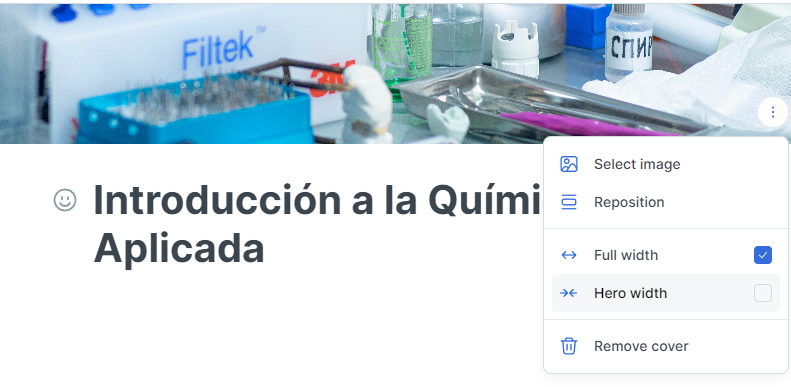<figcaption>
El menú desplegado cuenta con la opción de seleccionar imagen, reposición (ubicar la imagen seleccionada a gusto), el tipo de encuadre para nuestra imagen en el documento y eliminar imagen de portada. 
</figcaption></figure>

<figure><figcaption>
Se puede seleccionar la imagen subiendo desde el equipo a la web desde la pestaña de <em>Files.</em>
</figcaption></figure>

<figure><figcaption>
Se puede seleccionar la imagen desde la URL en la segunda pestaña del menú.
</figcaption></figure>

<figure><figcaption>
En la tercera pestaña Unsplash podemos seleccionar una imagen desde GitHub.
</figcaption></figure>

<figure>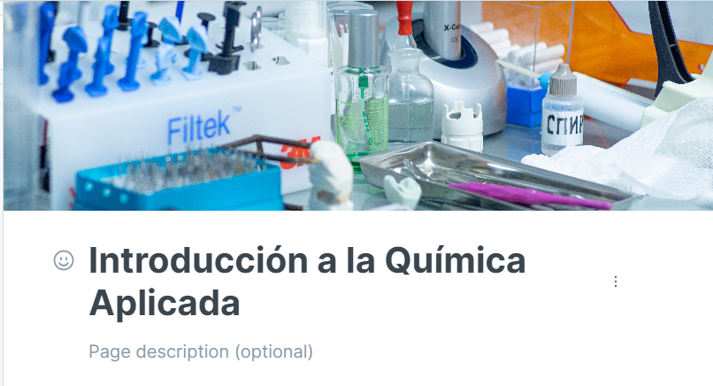<figcaption>
Vista una vez seleccionada la imagen.
</figcaption></figure>

#### Reposición de la imagen de portada.

<figure><figcaption>
En la opción de reposición podemos cambiar la posición de la imagen que habíamos seleccionado. 
</figcaption></figure>

<figure>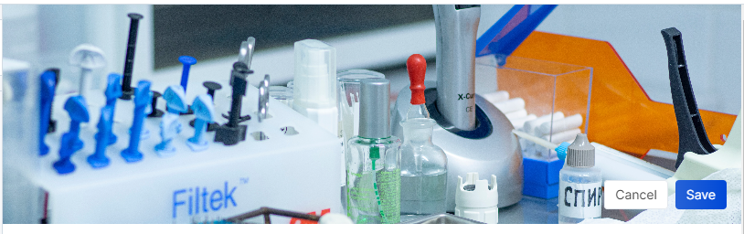<figcaption>
Con esta opción reposicionamos una vista diferente de la misma imagen.
</figcaption></figure>

#### Tamaño de la portada

<figure><figcaption>
En <em>Hero Width</em> se observa la portada sin que ocupe toda la página, coincide con el margen del texto.
</figcaption></figure>

 

<figure><figcaption>
Seleccionando <em>Full Width</em> la portada ocupa toda la página.
</figcaption></figure>

#### Eliminar portada

<figure>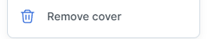<figcaption>
Para eliminar la portada seleccionamos <em>Remove Cover.</em>
</figcaption></figure>

#### Descripción del archivo

<figure><figcaption>
Ubicar el mouse en <em>Page description (optional).</em>
</figcaption></figure>

<figure>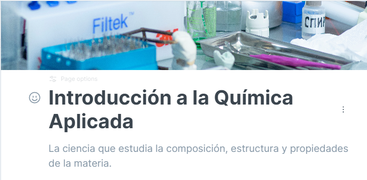<figcaption>
Añadir texto para nuestra descripción.
</figcaption></figure>

#### Opciones de texto.

<figure>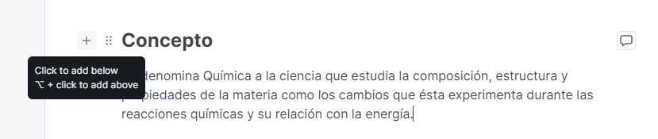<figcaption>
Para añadir texto siempre debemos ubicarnos en el ícono + del párrafo anterior ara añadir un siguiente párrafo.
</figcaption></figure>

<figure><figcaption>
Zoom al ícono + que desplegará un menú de opciones a agregar en el siguiente párrafo.
</figcaption></figure>

<figure><figcaption>
Si queremos agregar texto seleccionares <em>Paragraph</em>, <em>Heading</em> 1, 2 y 3 es para añadir títulos de acuerdo a una jerarquía de importancia lo cual se observa en el tamaño de cada uno. Luego encontramos 3 opciones de listas.
</figcaption></figure>

<figure><figcaption>
El párrafo cuenta con opciones como añadir código, importar contenido, insertar lista, usar template. Se resalta agregar un comentario.
</figcaption></figure>

<figure>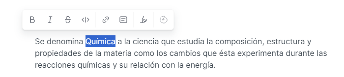<figcaption>
Podemos editar el texto del párrafo subrayando y por consiguiente habilitando este menú, o con comandos de teclado. Entre las opciones se encuentran <strong>negrita</strong>, <em>cursiva</em>, <del>tachar</del>, <code>comando</code>, enlace, agregar una nota, cambiar el color de la <mark style="color:blue;">letra</mark> o el <mark style="background-color:blue;">fondo</mark> de la letra, y por último reestablecer a la configuración inicial del párrafo.
</figcaption></figure>

***

<figure><figcaption>
Para el título de Concepto seleccionamos la opción de Heading 1.
</figcaption></figure>

<figure>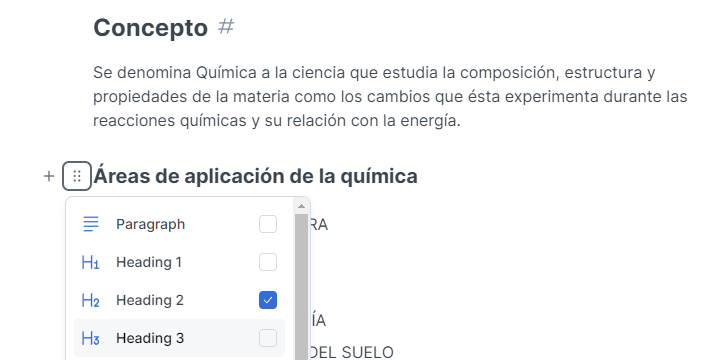<figcaption>
Para Áreas de aplicación de la química seleccionamos la opción de Heading 2.
</figcaption></figure>

<figure><figcaption>
¨Los elemento químicos del suelo pueden hallarse en:¨ se encuentra en Heading 2, ¨En fase sólida¨ seleccionamos Heading 3.
</figcaption></figure>

<figure><figcaption>
El las opciones de cita podemos encontrarnos en primer lugar con <em>Unordered List.</em>
</figcaption></figure>

 

<figure><figcaption>
Unordered List nos cita con puntos, no es necesario preocuparse por el orden, este tipo de cita facilita cuando requerimos realizar párrafos entre cada cita.
</figcaption></figure>

<figure><figcaption>
La segunda opción es <em>Ordered List</em>.
</figcaption></figure>

 

<figure><figcaption>
En esta opción citamos con números respetando un orden continuo.
</figcaption></figure>

<figure><figcaption>
La última opción de cita es <em>Task List.</em>
</figcaption></figure>

 

<figure><figcaption>
En Task List podemos hacer una lista tachable para diversos usos como ¨cosas para hacer¨
</figcaption></figure>

***

<figure><figcaption>
Continuando la lista de opciones para el siguiente párrafo nos encontramos con <em>Divider</em> para añadir una divisoria, <em>Hint</em> para señalar un dato, <em>Quote</em> para agregar una cita, <em>Code Block</em> para añadir códigos de comandos, familiar en la programación, <em>Insert files</em> para añadir archivos, <em>insert images</em> para agregar imágenes, con <em>Embed a URL</em> podemos añadir una dirección web a nuestro documento e incluso videos. 
</figcaption></figure>

***

<figure><figcaption>
<em>Divider</em> en el menú.
</figcaption></figure>

 

<figure><figcaption>
Debajo del texto podemos observar una línea recta el cual es hecho con <em>Divider</em>.
</figcaption></figure>

***

<figure><figcaption>
Opción de <em>Hint</em> en el menú.
</figcaption></figure>

 

<figure><figcaption>
Hint sirve para añadir un dato, advertencia o semejante.
</figcaption></figure>

***

<figure><figcaption>
Opción de Quote en el menú.
</figcaption></figure>

 

<figure><figcaption>
De esta forma se observa las citas en GitBook.
</figcaption></figure>

***

<figure><figcaption>
La opción de <em>Code Block</em> funciona con comandos de códigos.
</figcaption></figure>

 

<figure><figcaption>
Opción de <em>Code Block</em> en el menú.
</figcaption></figure>

***

<figure><figcaption>
Insert Files en el page de GitBook.
</figcaption></figure>

 

<figure><figcaption>
Seleccionar un archivo desde el equipo.
</figcaption></figure>

<figure><figcaption>
Una vez integrado se ve de esta manera.
</figcaption></figure>

 

<figure><figcaption>
Al hacer click se descarga automáticamente el archivo.
</figcaption></figure>

***

<figure><figcaption>
Para la opción de <em>Insert Images</em> nos sale las opciones ya conocidas anteriormente al seleccionar la imagen para la portada.
</figcaption></figure>

<figure><figcaption>
Insertar imagen desde File, es decir subir una imagen desde el equipo a la web.
</figcaption></figure>

 

<figure><figcaption>
Insertar imagen desde la URL.
</figcaption></figure>

 

<figure><figcaption>
Unsplash para seleccionar imágenes desde el buscador con las opciones disponibles en la página.
</figcaption></figure>

***

<figure><figcaption>
Opción para agregar un URL.
</figcaption></figure>

 

<figure><figcaption>
Pestaña para insertar el URL a incrustar
</figcaption></figure>

<figure><figcaption>
De esta manera se observa el URL incrustado de un video de YouTube.
</figcaption></figure>

<figure>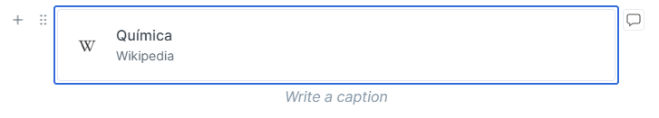<figcaption>
Artículo de Wikipedia incrustado por medio del URL.
</figcaption></figure>

***

<figure><figcaption>
Opción <em>Table</em> desde el menú.
</figcaption></figure>

 

<figure><figcaption>
Con esto podemos agregar una tabla de datos.
</figcaption></figure>

***

<figure><figcaption>
<em>Cards</em> genera un panel de tarjetas con una imagen y espacio para su descripción.
</figcaption></figure>

 

<figure><figcaption>
Vista de Cards desde el menú.
</figcaption></figure>

***

<figure><figcaption>
Opción de <em>Tabs</em> vistas en el menú.
</figcaption></figure>

<figure><figcaption>
Genera un panel de pestañas interactivas en el documento.
</figcaption></figure>

 

<figure><figcaption>
Segunda pestaña en <em>Tabs</em>.
</figcaption></figure>

***

<figure><figcaption>
Opción de <em>Expandable</em> en el menú.
</figcaption></figure>

<figure><figcaption>
Pestaña desplegable insertada en el archivo. En la imagen observamos el texto desplegado. 
</figcaption></figure>

 

<figure><figcaption>
La pestaña sin desplegar se ve de esta forma.
</figcaption></figure>

***

<figure>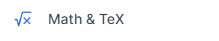<figcaption>
Opción para  incrustar una fórmula matemática a nuestro texto.
</figcaption></figure>

<figure><figcaption>
Se debe escribir la fórmula en la pestaña emergente y apretar <em>Enter</em>.
</figcaption></figure>

 

<figure><figcaption>
Fórmula matemática una vez añadida.
</figcaption></figure>

***

<figure>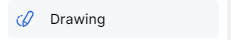<figcaption>
Opción para añadir un boceto.
</figcaption></figure>

<figure><figcaption>
Una vez seleccionado <em>Drawing</em> en el menú aparece una ventana en la que debemos hacer doble click para abrir una ventana emergente para realizar nuestro dibujo.
</figcaption></figure>

<figure><figcaption>
En la pestaña emergente podemos realizar nuestros bocetos, esquemas o un pequeño mapa mental con las herramientas disponibles.
</figcaption></figure>

<figure>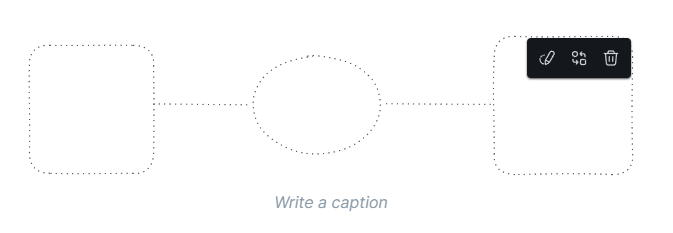<figcaption>
Una vez finalizado podemos observar el boceto realizado en la pestaña emergente incrustado en el page.
</figcaption></figure>


_**Write Caption**_

En cada archivo incrustado ya sea imagen, boceto, tabla o URL nos aparece un subtítulo a rellenar para escribir un subtítulo o descripción al archivo incrustado.&#x20;


***

<figure><figcaption>
Opción para incrustar Link de otra Page de GitBook en el documento.
</figcaption></figure>

<figure><figcaption>
En el menú emergente salen otros pages de la propia cuenta.
</figcaption></figure>

 

<figure><figcaption>
Una vez seleccionado e incrustado se observa de esta manera.
</figcaption></figure>

***

<figure><figcaption>
También en el menú se e encuentran las opciones de utilizar API el cual nunca utilicé.
</figcaption></figure>

 

<figure><figcaption>
A continuación se pueden incrustar archivos de diversas páginas y apps.
</figcaption></figure>

<figure><figcaption>
Apps y páginas compatibles para incrustar archivos.
</figcaption></figure>

 

<figure><figcaption>
Apps y páginas  compatibles para incrustar archivos.
</figcaption></figure>

 

<figure><figcaption>
También se puede incrustar los archivos de Google.
</figcaption></figure>

<figure>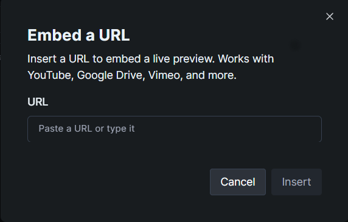<figcaption>
Al seleccionar cualquiera de las opciones sale la misma venta en la que se solicita el URL a incrustar.
</figcaption></figure>

***

#### Mover un párrafo de lugar

<figure><figcaption>
Primero debemos seleccionar los 6 puntos que se observa al lado izquierdo del párrafo.
</figcaption></figure>

<figure><figcaption>
Al trasladar se lee <em>Move Block</em> hasta que lo fijamos en su nuevo orden.
</figcaption></figure>

 

<figure><figcaption>
Así hemos trasladado el título hacia abajo.
</figcaption></figure>

***

#### Publicar en la Web

<figure><figcaption>
Nos ubicamos en el menú superior.
</figcaption></figure>

 

<figure><figcaption>
Al margen superior derecho encontramos Share para compartir el GitBook.
</figcaption></figure>

<figure><figcaption>
El archivo puede ser compartido a otros usuarios, a una audiencia determinada, en la web como documento público relacionado a GitHub o simplemente compartir como PDF.
</figcaption></figure>

 

<figure><figcaption>
Seleccionamos <em>Publish to the Web,</em> y deslizamos el interactivo para publicarlo en la Web.
</figcaption></figure>

<figure><figcaption>
Ahora se ha publicado el GitBook.
</figcaption></figure>


Link del GitBook del ejemplo.


***

## <mark style="color:purple;">Felicidades por completar el tutorial.</mark>

¡Espero que este tutorial te haya sido de utilidad! Si tienes alguna pregunta o necesitas más ayuda, no dudes en contactarnos. ¡Gracias por leer y buena suerte en tus proyectos futuros!
